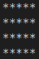

## NestedLoops Lab Overview

In this lab you will learn about **nested loops**, which are useful in several ways:
* They can create interesting output patterns
* They are essential in managing two-dimensional arrays (which we will get to soon)
* They are used in several sorting algorithms including bubble and insertion sorts.

## What are nested loops?
* Nested loops are two loops, one "nested" inside the other.
* The first loop is called the "outer" loop (sometimes called the "row" loop).
    * Its primary job is to set out the number of rows for the pattern.
* The second loop, the "column" loop is *nested* inside of the row loop, and has the job of controlling the process for each row.

### Example 1
``` java
for(int r = 0; r < 4; r++) {
    for(int c = 0; c < 5; c++) {
        System.out.print(r);
    }
    System.out.println();
}
```
Output:


Here is the sequence of events for this example:
* `r`, the loop control variable of the first loop starts at `0`
    * While `r` has a value of `0`, the second loop makes a complete cyle with `c` going from `0` to `4`, effectively outputing the value of `r` five times.
* As `r` steps through the values `1`, `2,` and `3`, the second loop variables cycles from `0` to `4` each time outputting the `r` value five times on each row.

### Example 2
``` java
for(int r = 0; r < 4; r++) {
    for(int c = 0; c < 5; c++) {
        System.out.print(c);
    }
    System.out.println();
}
```
Output:


This second example has the exact same loop structure as the first, but this time the `c` is the output value.

### Example 3
``` java
for(int r = 0; r < 4; r++) {
    for(int c = 0; c < 5; c++) {
        System.out.print("*");
    }
    System.out.println();
}
```
Output:



In this example, a star ("*") is output each time, creating a 4x5 box pattern.

### Example 4


Here a method called `box` is defined, receiving two integer parameters representing the height and width of a box pattern.

It is then called three times to create an interesting composite pattern:


### Example 5


Output:


Here is a method called `triangle`.  Study it carefully and see if you can figure out what is happening to create the triangle pattern.


<details><summary>Here is out it works:</summary>
<p>
<ul><li> The outside loop is the same as before, establishing how many rows will be created.</li>
<li>The inside loop is different, it will start at 0, but the check of the loop is different: instead of using the value of <code>side</code>, it uses the changing value of <code>r</code>, creating the triangle effect.</li>
<li> When the <code>r</code> has value 1, the inside loop takes <u>two steps</u>.</li>
<li>When <code>r</code> is 2, <code>c</code> takes <u>three steps</u>.
<li>When <code>r</code> is 3, <code>c</code> takes <u>four steps</u>.
<li>When <code>r</code> is 4, <code>c</code> takes <u>five steps</u> and the triangle is complete.
</ul>
</p>
</details>

### Example 6


Output:


Here we have a reverse triangle which requires <u>two inside loops</u>, one to create the indented spaces, and the second to create the star pattern.
* The outside loop is the same as in the previous examples, responsible for establishing the number of rows.
* The first inside loop creates blank spaces to indent the output, first creating four spaces on the first row, three on the second row, 2 on the third row, 1 on the fourth row, and none on the fifth row.
* The second inside loop immediately follows the first inside loop with the correct number of stars for each row, first one, then two, then three, then four, then five.

### Example 7


Output:


This one creates a pyramid by adapting the reverse triangle method.  Can you spot the change in the code?

### Example 8


Output:


### Example 9


Output:


This creates a hollow box.  The original `box` method is modified for this one.  Notice how the `if-else` statement is used to control the output.

### Example 10


Output:


Another adaptation of the box method creates this interesting checkerboard pattern.

## Lesson Summary
* The possibilities for nested loop output patterns are numerous, only limited by your imagination and ability to produce what you imagine.
* In all of the examples shown here, the nested loop structure was similar:
    * Outside loop to control the rows, inside loop to control the columns.
* Once you understand how to control these aspects of nested loops, the various outputs are just modifications and adjustments of them.

## JavaDoc
Javadoc is a tool which comes with the JDK and it is used for generating Java code documentation in HTML format from Java source code, which requires documentation in a predefined format.  

The starter code for the `NestedLoops` class has the Javadoc header (information about the program) already filled in.  You need to update the `@author` value and the `@since` value to your name and the last date your program was edited accordingly.

In addition, the Javadocs for the `box` and `main` methods are both complete as examples.  

## Assignment
In this assignment, you will complete the class `NestedLoops.java`.

The first 7 problems are just duplicating the seven methods given above.

Then you are asked to create some new methods using nested loop patterns.  You may use any previously defined methods to create these new ones.

### Problem 1
Write a method (WAM) called `box` that will receive two integer parameters for the rows and columns and ouput a box star pattern (see example #4)


### Problem 2
WAM called `triangle` that will receive one integer parameter and create a triangle star pattern (see example #5)


### Problem 3
WAM called `reverseTri` that will receive one integer parameter and create a reverse triangle star pattern (see example #6).


### Problem 4
WAM called `pyramid` that will receive one integer parameter and create a pyramid star pattern (see example #7).


### Problem 5
WAM called `invertedPyramid` that will receive one integer parameter and create an inverted pyramid star pattern (see example #8).


### Problem 6
WAM called `hollowBox` that will receive two integer parameters and create a hollow box star pattern (see example #9).


### Problem 7
WAM called `checkers` that will receive two integer parameters and create a checkerboard star pattern (see example #10).


### Problem 8
WAM called `reflectedPyramid` that will receive one integer parameter and create a reflected pyramid shape, as shown below.


### Problem 9
WAM called `hourGlass` that will receive one integer parameter and create an hour glass shape, as shown below.


### Problem 10
WAM called `diamond` that will receive one integer parameter and create a diamond shape, as shown below.  Note this is **different* from Problem 8.


### Problem 11
WAM called `doubleBorderBox` that will receive two integer parameters and create a hollow box with a double star border, as shown.


### Problem 12
WAM called `hollowDiamond` that will receive one integer parameter and create a hollow diamond.


### Javadoc
* Complete the documentation for all of the methods in the class.  
* Run the Javadoc utility by opening a terminal, going to the folder containing `NestedLoops.java` and typing `javadoc NestedLoops.java`.  
* You will see a **lot** of new files appear in the directory.  
* Open `index.html` or `index-all.html` in your web browser to see the documentation.  
* Look through your documentation for typos and mistakes.  You can always re-run `javadoc` and it will update the documentation.

## Submission
Be sure to add/commit/push all of your changes (including the Javadocs).


