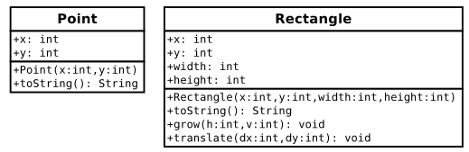
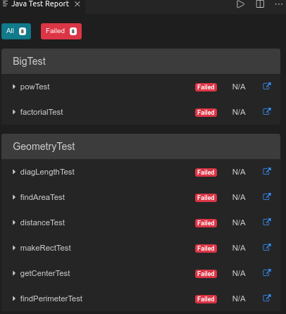

# Objects

An **object** is a collection of data that provides a set of methods.  For example, a `String` is a collection of characters that provides methods like `charAt` and `substring`.

Java is an *object-oriented* language, which means that it uses objects to represent data and provide methods related to them.  This way of organizing programs is a powerful, and popular, design concept.  Note that Python is also an object-oriented language.

## Point Objects

The `java.awt` package provides a class named `Point` intended to represent the coordinates of a location in a Cartesian plane.  In mathematical notation, points are often written in parentheses with a comma separating the coordinates.  For example, (0, 0) indicates the origin, and (x, y) indicates the point x units to the right and y units up from the origin.

In order to use the `Point` class, you have to import it:
``` java
import java.awt.Point;
```
Then, to create a new point, you have to use the `new` operator:
``` java
Point blank = new Point(3, 4);
```
The result of the `new` operator is a *reference* to the new object.  So `blank` contains a reference to the `Point` object.  Think of a reference as a location (or address) in memory associated with the object.  In other words `blank` is not actually holding the `Point` object, it is holding an address.  This is unlike primitive types like `int` or `double` where the variable is storing the actual value.

## Attributes

Variables that belong to an object are usually called **attributes**, but you may also see them called "fields" or "instance variables".  To access an attribute of an object, Java uses **dot notation**.  For example:
``` java
 int x = blank.x;
  ```
The expression `blank.x` means "go to the object `blank` refers to, and get the value of the attribute `x`."  In this case, we assign that value to a local variable named `x`.  There is no conflict between the local variable named `x` and the attribute named `x`.  The purpose of dot notation is to identify *which* variable you are referring to unambiguously.

You can use dot notation as part of an expression.  For example:
``` java
System.out.println(blank.x + ", " + blank.y);
int sum = blank.x * blank.x + blank.y * blank.y;
```
The first line dispalys `3, 4`; the second line calculates the value `25`.

## Objects as parameters

You can pass objects as parameters just like primitives.  For example:
``` java
public static void printPoint(Point p) {
  System.out.println("(" + p.x + ", " + p.y + ")");
}
```
This method takes a point as an argument and displays its attributes in parentheses.  If you invoke `printPoint(blank)`, it displays `(3, 4)`.

But we don't really need a method like `printPoint`, because if you invoke `System.out.println(blank)` you get:
```
java.awt.Point[x=3,y=4]
```
`Point` objects provide a method called `toString` that returns a string representation of a point.  When you call `println` with objects, it automatically calls `toString` and displays the result.  (This is similar to how `__str__` worked in Python.)  In this case, it shows the name of the type (`java.awt.Point`) and the names and values of the attributes.

As another example, we can write a `distance` method so that it takes two `Points` as parameters:
``` java
public static double distance(Point p1, Point p2) {
  int dx = p2.x - p1.x;
  int dy = p2.y - p1.y;
  return Math.sqrt(dx * dx + dy * dy);
}
```
Passing objects as parameters makes the source code more readable and less error-prone, because related values are bundled together.

## Objects as return types

The `java.awt` package also provides a class called `Rectangle`.  (awt stands for "Abstract Window Toolkit" in case you were curious.) To use it, you have to import it:
``` java
import java.awt.Rectangle;
```
`Rectangle` objects are similar to points, but they have four attributes: `x`, `y, `width`, and `height`.  The following example creates a `Rectangle` object and makes the variable `box` refer to it:
``` java
Rectangle box = new Rectangle(0, 0, 100, 200);
```
If you run System.out.println(box), you get:
```
java.awt.Rectangle[x=0,y=0,width=100,height=200]
```
Again, `println` uses the `toString` method provided by `Rectangle`, which knows how to display `Rectangle` objects.

You can write methods that return objects.  For example, `findCenter` takes a rectangle as an argument and returns a `Point` with the coordinates of the center of the rectangle:
``` java
public static Point findCenter(Rectangle box) {
  int x = box.x + box.width / 2;
  int y = box.y + box.height / 2;
  return new Point(x, y);
}
```
The return type of this method is `Point`.  The last line creates a new `Point` object and returns a reference to it.

## Mutable objects

You can change the contents of an object by making an assignment to one of its attributes.  For example, to "move" a rectangle without changing its size, you can modify its `x` and `y` values:
``` java
Rectangle box = new Rectangle(0, 0, 100, 200);
box.x = box.x + 50;
box.y = box.y + 100;
```
We can encapsulate this code in a method and generalize it to move the rectangle by any amount:
``` java
public static void moveRect(Rectangle box, int dx, int dy) {
    box.x = box.x + dx;
    box.y = box.y + dy;
}
```
The variables `dx` and `dy` indicate how far to move the rectangle in each direction.  Invoking this method has the effect of modifying the `Rectangle` that is passed as an argument.
``` java
Rectangle box = new Rectangle(0, 0, 100, 200);
moveRect(box, 50, 100);
System.out.println(box);
```
Modifying objects by passing them as arguments to methods can be useful.  But it can also make debugging more difficult, because it is not always clear which methods will modify their arguments.

Java provides some methods that operate on `Points` and `Rectangles`.  For example, `translate` has the same effect as `moveRect`, but instead of passing the rectangle as an argument, you use dot notation:
``` java
box.translate(50, 100);
```
This line invokes the `translate` method for the object that `box` refers to.  As a result, the `box` object is updated directly.

This example is a good illustration of **object-oriented** programming.  Rather than write methods like `moveRect` that modify one or more parameters, we apply methods to objects themselves using dot notation.

## Aliasing

Remember that when you assign an object to a variable, you are assigning a *reference* to an object.  It is possible to have multiple variables that refer to the same object.  For example,
``` java
Rectangle box1 = new Rectangle(0, 0, 100, 200);
Rectangle box2 = box1;
```
`box1` and `box2` are **aliases** for the same object.  This means that any changes that affect one variable also affect the other.  This example adds 50 to all four sides of the rectangle, so it moves the corner up and to the left by 50, and it increases the height and width by 100:
``` java
System.out.println(box2.width);
box1.grow(50, 50);
System.out.println(box2.width);
```
The first line displays `100`, which is the width of the `Rectangle` referred to by `box2`.  The second line invokes the `grow` method on `box1`, which stretches the `Rectangle` horizontally and vertically.  The last line displays `200`, the width of the expanded rectangle.  Again, notice that changing `box1` *also* changed `box2` because **`box1` and `box2` reference the same object.**

## The `null` keyword
When you create an object variable, remember that you are storing a reference to an object (have I mentioned that before?).  In Java, the keyword `null` is a special value that means "no object".  You can declare and initialize object variables this way:
``` java
Point blank = null;
```
If you try to use a `null` value, either by accessing an attribute or invoking a method, Java throws a `NullPointerException`.
``` java
Point blank = null;
int x = blank.x;                  // NullPointerException
blank.translate(50, 50);          // NullPointerException
```
On the other hand, it is legal to pass a null reference as an argument or receive one as a return value.  For example, `null` is often used to represent a special condition or indicate an error.

## Garbage Collection
We have seen what happens when more than one variable refers to the same object (what happens?).  But what happens when *no* variables refer to an object?
``` java
Point blank = new Point(3, 4);
blank = null;
```
The first line creates a new `Point` object and makes `blank` refer to it.  The second line changes `blank` so that instead of referring to the object, it refers to nothing.  So what happened to the `Point` object that was created?

If there are no references to an object, there is no way to access its attributes or invoke a method on it.  From the programmer's view, it ceases to exist.  However, it's still present in the computer's memory, taking up space.

As your program runs, the system automatically looks for stranded objects and deletes them; then the space can be reused for new objects.  This process is called **garbage collection**.

You don't have to do anything to make garbage collection happen, and in general you don't have to be aware of it.  But in high-performance applications you may notice a slight delay every now and then when Java reclaims space from discarded objects.

## Class Diagrams
To summarize, `Point` and `Rectangle` objects each have their own attributes and methods.  Attributes are an object's *data*, and methods are an object's *behaviors*.  An object's class defines which attributes and methods it will have.

In practice, it's more convenient to look at high-level pictures than to examine the source code.  **Unified Modeling Language** (UML) defines a standard way to summarize the design of a class.



As shown above, a **class diagram** is divided into two sections.  The top half lists the attributes and the bottom half lists the methods.  UML uses a language-independent format, so rather than showing `int x`, the diagram uses `x: int`.

## Java library source
We have used classes from the Java library including `System`, `String`, `Scanner`, and `Math`.  You may not have realized that these classes are written in Java.  In fact, you can take a look at the source code to see how they work.

The Java library contains thousands of files, many of which are thousands of lines of code.  That's more than one person could read and understand fully, so don't freak out!

Because it's so large, the library source code is stored in a file named `src.zip`.  Go ahead and find that file on your computer.  If you're at school, open the File Manager, then in the top address bar type in `/usr/lib/jvm/openjdk-8/`.  Inside of this folder you should see `src.zip`.  Double click on it and it should open in the "Archive Manager."  **Do not extract this folder**.  You can browse through the files and open them straight from the Archive Manager.

When you open the file, you will see folders that correspond to Java packages.  For example, open the `java` folder and then open the `awt` folder.  You should now be able to find `Point.java` and `Rectangle.java`, along with the other classes in the `java.awt` package.

Open `Point.java` in Mousepad and skim through the file.  It uses language features we haven't gotten to yet, so you probably won't understand everything.  But you can get a sense of what professional Java software looks like by browsing through the library.

Notice how much of `Point.java` is documentation.  Each method is thoroughly commented, including `@param`, `@return` and other Javadoc tags.  You can see the results by reading the documentation for the `Point` class, which you can find by doing a Google search for "Java Point".

Now take a look at `Rectangle`'s `grow` and `translate` methods.  There is more to them than you may have realized, but that doesn't limit your ability to use these methods in a program.

To summarize the entire lesson:
* objects encapsulate data and provide methods to access and modify the data directly
* object-oriented programming makes it possible to hide messy details so that you can more easily use and understand code that other people wrote

## Assignment

### Part 1
**Before you start the assignment** you need to install a new extension in Visual Studio Code.  Search for an extension called "Java Test Runner".  It is made by Microsoft.  Install it and enable it.  

There should now be something that looks like a graduated cylinder in the menu bar on the left.  This is for running tests.  If you click that button, then click the right arrow at the top of that pane (it looks like a triangle on its side), it should open a panel like the one shown:



These are called "Java Unit Tests".  They automate checking whether or not your program is working correctly.  We will use JUnit tests off and on throughout the year.

Write the methods in the `Geometry.java` class so that all of the tests shown pass.  Whenever possible, you shold use previously written methods rather than duplicating code.  Javadocs have been included for all of the methods.


### Part 2

1. Open the program `Big.java` and complete the static method `factorial` that returns the factorial of a given integer.  

    ``` java
    public static int factorial(int n)
    ```
    The factorial of a number is defined as the product of all of the positive integers less than or equal to the number.  The mathematical notation for factorial is the exclamation mark (!).  For example:
    ```
    0! = 1
    1! = 1
    2! = 2 * 1 = 2
    3! = 3 * 2 = 6
    4! = 4 * 3 * 2 * 1 = 24
    5! = 5 * 4 * 3 * 2 * 1 = 120
    ...
    ```
    Your method should be iterative (not recursive).  That is, you should use some kind of a loop.

2. Write a `main` method that displays a table of the integers from 0 to 30 along with their factorials.  Something like this:
    ```
    0! = 1
    1! = 1
    2! = 2
    3! = 6
    4! = 24
    ...
    ```
    Again, you *should use a loop* to do this.  **Do not** just type in or copy/paste 30 lines of code!

    Around 15, you will probably see the answers aren't right anymore. Why not?

3. `BigInteger` is a Java class that can represent arbitrarily big integers.  There is no upper bound except the limitations of memory size and processing speed. Take a minute to read the documentation, which you can find by doing a web search for "Java BigInteger".

4.  To use BigIntegers, you have to import `java.math.BigInteger` at the beginning of your program.

5.  There are several ways to create a `BigInteger`, but the simplest uses `valueOf`.  The following code converts an integer to a BigInteger:
    ``` java
    int x = 17;
    BigInteger big = BigInteger.valueOf(x);
    ```

6. Since BigIntegers are not primitive types, the usual math operators don't work.  Instead, we have to use methods like `add`.  To add two BigIntegers, invoke `add` on one and pass the other as anargument.
    ``` java
    BigInteger small = BigInteger.valueOf(17);
    BigInteger big = BigInteger.valueOf(17000000000000);
    BigInteger total = small.add(big);
    ```
    Try out some of the other methods like `multiply` and `pow`.  Use your `main` method for testing.

7.  Convert `factorial` so that it performs its calculations using `BigIntegers` and returns a `BigInteger` as a result.  You should leave the parameter alone; it will still be an `int`.  

8.  Use the provided JUnit tests to confirm that your methods work correctly.

9.  Update your `main` method so that it displays the table with your modified factorial method.  Is it correct up to 30?  How high can you make it go?

10.  Are `BigInteger` objects mutable or immutable?  How can you tell?
    **Type your answer here**


### Part 3
Many encryption algorithms depend on the ability to raise large integers to a power.  Here is a method that implements an efficient algoritm for integer exponentiation:
``` java
public static int pow(int x, int n) {
  if (n == 0) return 1;

  int result = 1;
  for(int i = 0; i < n; i++) {
    result = result * x;
  }
  return result
}
```
The problem with this method is that it only works if the result is small enough to be represented by an `int`.  Rewrite it so that the result is a `BigInteger`.  The parameters should still be integers, though.

You should use the `BigInteger` methods `add` and/or `multiply`.  **Don't use** `BigInteger.pow`; that would spoil the fun!

------
Much of the text, examples, and assignments in this activity are from [Think Java](https://greenteapress.com/wp/think-java/) by Allen Downey and Chris Mayfield.
